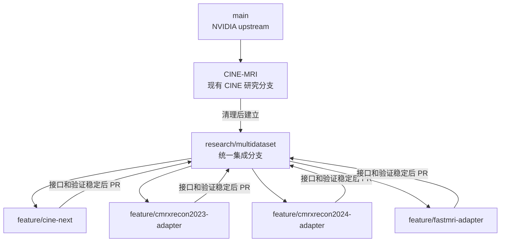

# 代码与实验资产迁移路线

> 状态：已确认的迁移方案，尚未开始执行破坏性整理
> 首次记录：2026-08-24
> 适用仓库：`NV-Raw2insights-MRI` 及其服务器 worktree
> 原则：本文是后续整理工作的决策基线。若路线改变，必须更新文末的“变更记录”，写明日期、原因和影响，不以聊天中的临时建议覆盖本文。

## 1. 目标

把目前散落在本地、GitHub 和服务器多个目录中的代码与实验资产整理成一个可长期维护的多数据集项目，同时满足以下要求：

1. CINE、CMRxRecon 2023、CMRxRecon 2024 和 fastMRI 可以独立开发和验证。
2. 不要求尚未稳定的数据集适配代码立即合并。
3. 最终由一个中立的集成分支提供统一入口、统一配置格式和统一结果记录方式。
4. Git 只管理代码、配置、小型清单和文档；大型数据、模型缓存、推理输出与评价结果留在服务器。
5. 已完成实验必须可追溯，但不靠永久保留大量实验分支来实现。
6. 原始 H5、原始 mask 和其他上游数据始终只读。

## 2. 已确认的分支定位

`CINE-MRI` 本身是一个数据集/研究分支，不是中立的集成分支。不能让其他数据集长期以它作为最终汇合点。

分支职责固定如下：

| 分支 | 职责 | 长期状态 |
| --- | --- | --- |
| `main` | NVIDIA 上游基线；只接收适合回到通用基线的改动 | 长期保留 |
| `CINE-MRI` | 现有 CINE 研究历史与当前积累；在迁移完成前保持兼容 | 长期保留，后续以维护/历史兼容为主 |
| `research/multidataset` | 新的多数据集集成分支；统一入口和公共接口的唯一归属地 | 长期保留，未来日常开发基线 |
| `feature/cine-next` | 从现有 CINE 代码中提取、规范化下一版 CINE adapter | 临时，合并后删除 |
| `feature/cmrxrecon2023-adapter` | CMRxRecon 2023 数据适配与验证 | 临时，合并后删除 |
| `feature/cmrxrecon2024-adapter` | CMRxRecon 2024 数据适配与验证 | 临时，合并后删除 |
| `feature/fastmri-adapter` | fastMRI 数据适配与验证 | 临时，合并后删除 |

当前服务器上的 `feature/cmrxrecon-adapter` 是已有工作分支。在核对它的内容后，可以将有效提交迁移或重命名到更明确的 `feature/cmrxrecon2023-adapter`；不要直接把整个旧分支合并到集成分支。

目标关系如下：



## 3. Worktree 方案

这个项目可以按数据集建立 worktree，但必须牢记：worktree 是同一个 Git 仓库中不同分支的工作目录，不是独立仓库，也不会自动互相同步。

每个 worktree 都共享对象库和远程配置，但各自拥有独立的：

- 当前 checkout 分支；
- 工作区修改；
- 暂存区；
- 未跟踪文件。

只有在执行 `commit`、`fetch`、`pull`、`merge`、`rebase` 或 `cherry-pick` 后，变更才会在相应分支间传播。切换到某个 worktree 并不等于“本地自动与那个服务器目录同步”。服务器和本地仍通过 GitHub 上的分支同步；大型实验资产不通过 GitHub 同步。

### 3.1 本地建议布局

本地只建立正在编辑的 worktree，不为每个历史实验永久建立目录：

```text
/Users/zhongyu/Desktop/NV-Raw2insights-MRI/              # research/multidataset
/Users/zhongyu/Desktop/NV-Raw2insights-MRI-cine/         # feature/cine-next
/Users/zhongyu/Desktop/NV-Raw2insights-MRI-cmrx23/       # feature/cmrxrecon2023-adapter
/Users/zhongyu/Desktop/NV-Raw2insights-MRI-cmrx24/       # feature/cmrxrecon2024-adapter
/Users/zhongyu/Desktop/NV-Raw2insights-MRI-fastmri/      # feature/fastmri-adapter
```

当前 `/Users/zhongyu/Documents/NV-Raw2insights-MRI` 是指向 Desktop 仓库的符号链接，不应再把它当成第二份仓库或建立重复 worktree。

### 3.2 服务器建议布局

```text
/home/students/studxuzho1/NV-Raw2insights-MRI/           # 最终切到 research/multidataset
/home/students/studxuzho1/NV-Raw2insights-MRI-cine/      # 需要时建立
/home/students/studxuzho1/NV-Raw2insights-MRI-cmrx23/    # CMRxRecon 2023
/home/students/studxuzho1/NV-Raw2insights-MRI-cmrx24/    # 需要时建立
/home/students/studxuzho1/NV-Raw2insights-MRI-fastmri/   # 需要时建立
```

现有 `/home/students/studxuzho1/NV-Raw2insights-MRI-cmrxrecon` 先保留，在其未提交文件与实验引用核对完之前不改名、不删除。完成迁移后再决定把它登记为 `cmrx23` worktree，还是移除并重新创建。

服务器 worktree 只放代码和轻量配置。大型资产应放在仓库外的稳定根目录，或保留在已经建立且有清单记录的服务器目录中，避免因为删除 worktree 一并误删实验结果。

## 4. 代码最终结构

统一入口不要求所有 adapter 同时开发完成。先确定接口，再让各数据集分支独立实现。

目标结构示意：

```text
scripts/
  run_experiment.py                 # 唯一推荐的统一入口

src/nv_raw2insights_mri/
  adapters/
    base.py                         # adapter 接口
    registry.py                     # 名称到 adapter 的注册表
    cine.py
    cmrxrecon2023.py
    cmrxrecon2024.py
    fastmri.py
  pipelines/
    prepare.py
    inference.py
    evaluate.py
  experiment/
    config.py
    manifest.py

experiments/
  cine/
  cmrxrecon2023/
  cmrxrecon2024/
  fastmri/

docs/
  datasets/
  history/
```

配置至少需要表达：

```yaml
experiment_id: sdum-008
dataset: cmrxrecon2023
stage: inference
adapter: cmrxrecon2023
input_manifest: /server/path/to/input_manifest.json
output_root: /server/path/to/run
model:
  variant: base
  checkpoint: nvidia/NV-Raw2Insights-MRI
runtime:
  device: cuda
  seed: 8
```

统一入口的目标调用形式：

```bash
python scripts/run_experiment.py \
  --config experiments/cmrxrecon2023/sdum-008.yaml
```

在统一入口尚未完成前，现有 `scripts/inference.py` 和各评价脚本继续可用，不做一次性大改。新入口应先作为薄封装调用现有稳定逻辑，再逐步抽取公共模块。

## 5. Git 与实验资产的边界

### 5.1 应提交到 GitHub

- Python、shell 和 Slurm 脚本；
- 小型 JSON/YAML 配置；
- 数据集 manifest（只含路径、case ID、shape、checksum 等元数据，不含隐私数据）；
- 环境说明和依赖锁定文件；
- 指标汇总 CSV（体积合理且不含敏感内容时）；
- 迁移记录、实验说明和最终结论；
- 外部仓库的固定版本信息。

### 5.2 不应提交到 GitHub

- `dataset/`、`output/`、`outputs/`、`Results/`、`runs/`、`logs/`；
- 原始 H5、MAT、NPY、PNG 批量结果和压缩数据包；
- Hugging Face 模型缓存；
- 临时目录、锁文件和下载缓存；
- 嵌套仓库的 `.git` 目录；
- 密钥、token、账号信息或未脱敏临床元数据。

### 5.3 每个实验 run 的最小记录

每个正式 run 应有独立且不可复用的 `experiment_id`，并至少保留：

```text
runs/<experiment_id>/
  config.yaml             # 实际参数
  manifest.json           # 输入病例、shape、mask/checkpoint 标识
  git_state.json          # commit SHA、branch、dirty 状态
  environment.txt         # Python/CUDA/依赖摘要
  slurm.json              # job ID、节点、开始/结束和状态
  metrics/                # 汇总指标
  artifacts.json          # 大文件路径、大小和 checksum
  README.md               # 目的、结果、结论和异常
```

实验可复现性主要依靠 commit SHA、配置、manifest、环境与 artifact checksum；不要为 `sdum-001`、`sdum-002` 等每个实验永久保留一个 Git 分支。重要里程碑可使用 annotated tag，例如 `exp/sdum-008-final`。

## 6. 当前已知资产与处置原则

以下内容在迁移前必须保留并核对：

| 位置 | 已知状态 | 迁移原则 |
| --- | --- | --- |
| 服务器主 worktree | `CINE-MRI`，存在未跟踪的 SDUM 脚本 | 先复制/提交独有代码，再同步分支 |
| 服务器 CMRx worktree | `feature/cmrxrecon-adapter`，存在一个 `inference.py` 修改、多个未跟踪脚本和 Slurm 文件 | 逐文件核对；只迁移有效改动，不整体 merge |
| 本地 Desktop 仓库 | `CINE-MRI`，有已修改和未跟踪文件 | 作为代码清理与提交的主要编辑源 |
| 本地 Documents 路径 | Desktop 仓库的符号链接 | 不作为第二份副本处理 |
| 服务器 `dataset/`、`output/`、`Results/`、`runs/`、`archive/` | 包含现役与历史实验资产 | 建 registry 后再归档；未登记前不删除 |
| `dataset_v0`、`dataset_v1`、外部 CMRx 数据 | 仓库外数据与遗留 GT | 保持原路径，先生成清单 |
| 两套 Hugging Face cache | Base 模型可能重复，Large 只在默认 cache 中存在 | 统一引用后校验 checksum，再清重复副本 |
| `external/CMRxRecon2025` | 嵌套 Git clone | 记录 URL 和 commit，后续决定 submodule 或 source manifest；禁止直接提交嵌套 `.git` |

已经完成但缺少 summary 的 SDUM run，应先补评价或在 registry 中明确标为“输出完成、评价待补”，再做目录归档。活跃 Slurm/交互任务运行期间，不移动它正在引用的代码、输入或输出路径。

## 7. 分阶段迁移计划

### 阶段 0：冻结与盘点

目标：获得可核对的资产清单，不移动任何大型文件。

1. 等待当前相关服务器任务结束。
2. 记录本地、GitHub 和两个服务器 worktree 的 branch、HEAD、dirty 状态。
3. 生成代码差异清单：tracked 修改、untracked 文件、各分支独有提交。
4. 生成数据清单：路径、用途、病例数、文件数、大小、创建时间、所属实验和 checksum 策略。
5. 标记资产状态：`active`、`completed`、`incomplete`、`legacy`、`duplicate-candidate`、`unknown`。

完成门槛：所有准备移动或删除的对象都能在清单中找到，且没有状态为 `unknown` 的对象被处理。

### 阶段 1：收拢服务器独有代码

目标：让本地成为唯一的代码编辑源，同时不覆盖本地已有修改。

1. 从当前本地 dirty 状态建立 `codex/server-code-consolidation` 临时分支。
2. 备份本地工作区和两个服务器 worktree 的未提交代码清单。
3. 先使用 `rsync --dry-run` 或逐文件 diff 核对服务器独有脚本。
4. 只复制本地缺失或明确较新的代码；不复制 `dataset/`、`output/`、`Results/`、`runs/`、`logs/`、cache 和 `external/.git`。
5. 保留服务器 CMRx worktree 中较新的 cohort metadata fallback 逻辑。
6. 不用服务器版本覆盖本地核心文件；核心文件通过小块 diff 手工整合。
7. 按功能分组提交，禁止 `git add .`。

建议提交组：

1. `chore(repo): ignore local and generated artifacts`
2. `feat(sdum): add preparation and evaluation utilities`
3. `feat(cmrxrecon): consolidate cohort and mask utilities`
4. `chore(slurm): consolidate reproducible job scripts`
5. `docs: record server runs and migration decisions`

完成门槛：本地包含所有确认需要保留的服务器独有代码；`python -m compileall scripts` 通过；差异清单逐项销账。

### 阶段 2：建立真正的集成基线

目标：从清理后的 `CINE-MRI` 建立中立的多数据集开发基线。

1. 将阶段 1 的整理结果通过 review 合入 `CINE-MRI`。
2. 从确定的、干净的 `CINE-MRI` commit 创建 `research/multidataset`。
3. 在 `research/multidataset` 中增加统一配置 schema、adapter 接口、registry 和薄入口。
4. 为现有 CINE 行为建立回归测试，确保抽象接口没有改变现有结果语义。
5. 推送集成分支到 GitHub，设置分支说明和 PR 目标。

完成门槛：集成分支可以通过统一入口调用现有 CINE 流程，且不依赖其他数据集分支。

### 阶段 3：建立本地和服务器 worktree

目标：每个活跃数据集有独立工作目录，但共享统一 Git 历史。

1. 本地主仓库切到 `research/multidataset`。
2. 从它分别创建需要的 feature branch 和 worktree。
3. 服务器主 worktree 在备份未提交文件后切到 `research/multidataset`。
4. 现有 CMRx worktree 完成差异清理后，登记到明确的 CMRx 2023 分支。
5. 只有实际要运行或调试的数据集才在服务器创建 worktree。

完成门槛：`git worktree list` 中每个目录、分支和用途都能对应，且不存在同一分支被多个普通 worktree checkout 的情况。

### 阶段 4：逐个 adapter 迁移

目标：让每个数据集分支独立完成“准备—推理—评价”闭环。

推荐顺序：

1. CINE：作为现有行为的参照实现；
2. CMRxRecon 2023：复用现有服务器工作成果；
3. fastMRI：验证接口是否能覆盖不同文件结构和 GT；
4. CMRxRecon 2024：在前面接口稳定后接入。

每个 adapter 合并前必须满足：

- 输入 schema 和 shape/order 明确；
- 原始数据只读，派生数据路径明确；
- 小型 validator 或 smoke test 可运行；
- 一例 debug run 成功；
- 正式 cohort 的配置与 manifest 已保存；
- 输出 shape、dtype、finite 检查通过；
- 评价逻辑和 GT 定义已记录；
- 文档不依赖开发者记忆中的隐含路径。

满足条件后通过 PR 合入 `research/multidataset`。如果尚未满足，就继续保留在自己的 feature branch，不强行合并。

### 阶段 5：实验资产登记与归档

目标：把“乱七八糟的目录”变成可查询的 registry，再决定移动或清理。

1. 建立 `experiments/registry.csv` 或同等 JSON/YAML registry。
2. 为现有 CINE、CMRx、fastMRI 和 SDUM 实验补齐 ID、代码 SHA、输入、输出、状态和结论。
3. 对完成但缺评价的 run 补评价或明确标记。
4. 把 `archive/` 中仍有复现价值的资产登记为 `legacy`。
5. 对重复候选执行 checksum；只有路径引用已迁移且副本一致时才删除重复数据。
6. 对 debug、失败和中间产物设置保留期；删除前生成待删清单并人工确认。

完成门槛：任何大型目录都能从 registry 查到来源、用途、状态和负责人；清理动作有明确候选清单和恢复策略。

### 阶段 6：稳定化

目标：日常工作统一从集成分支开始，不再产生新的无登记孤岛。

1. 新数据集从 `research/multidataset` 创建短期 feature branch。
2. 新实验只使用已有 adapter 与配置；实验差异不再复制整套代码。
3. 每次正式运行自动记录 Git dirty 状态；dirty 时默认拒绝正式 run 或显式标注。
4. 合并后删除已经完成的 feature worktree 和远程临时分支。
5. 定期审查 registry、cache 和 archive，但不自动删除数据。

## 8. 合并与不合并规则

以下情况可以暂不合并：

- adapter 输入输出接口仍在变化；
- 只有开发者机器/服务器上的隐式路径才能运行；
- 尚未通过一例 debug run；
- 会改变其他数据集的现有行为且没有回归测试；
- 数据、GT 或指标定义仍不明确。

以下内容应尽早合入集成分支：

- 不依赖数据集的 bug fix；
- 配置解析、manifest、logging 和实验元数据工具；
- 统一 adapter interface 与 registry；
- 被至少两个数据集验证过的公共代码；
- 文档与小型 validator。

禁止使用以下做法：

- 把所有 dataset branch 一次性互相 merge；
- 把 `CINE-MRI` 直接当作其他数据集永久汇合分支；
- 用复制整个仓库的方式替代 Git worktree；
- 在本地和服务器分别修改同一个功能，再靠人工猜哪个较新；
- 把大型结果提交到 GitHub；
- 未登记、未校验就删除或覆盖服务器资产；
- 为每次实验创建永久 Git 分支。

## 9. 下一步执行顺序

接下来只做下面四件事，暂不创建全部 adapter 分支，也不移动大型数据：

1. 完成本地和服务器代码差异清单，并确认当前没有任务引用待整理文件。
2. 创建 `codex/server-code-consolidation`，把服务器独有代码安全收拢到本地并分组提交。
3. 输出第一版 `experiments/registry.csv`，登记所有现有实验目录及状态。
4. 以清理后的 `CINE-MRI` commit 创建 `research/multidataset`，先实现最小 adapter interface 和统一薄入口。

这四步完成并 review 后，再创建 CINE/CMRx23/CMRx24/fastMRI 的正式 worktree。

## 10. 变更控制

任何人提出改变本路线时，需要在这里新增一条记录，至少包括：

- 日期；
- 提议人；
- 原方案；
- 新方案；
- 改动理由；
- 对分支、worktree、实验复现和服务器路径的影响；
- 是否需要迁移已有资产。

### 变更记录

| 日期 | 决策 | 原因 | 影响 |
| --- | --- | --- | --- |
| 2026-08-24 | 明确 `CINE-MRI` 是 CINE 研究分支；新增 `research/multidataset` 作为集成分支 | 避免其他数据集长期依赖带有 CINE 历史语义的分支 | 后续 adapter 分支从集成分支建立；不立即重命名或删除 `CINE-MRI` |
| 2026-08-24 | 本地和服务器允许按活跃数据集建立 worktree，但不为每次实验建 worktree/分支 | 隔离代码开发，同时控制长期维护成本 | 实验复现改由 commit、config、manifest、环境和 tag 保证 |
